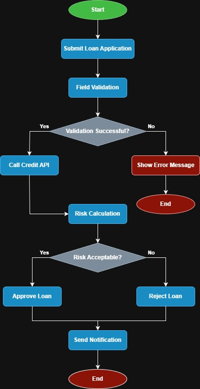

Digital Loan Application – Business Analysis Case Study

📌 Project Overview

This project represents an end-to-end Business Analysis case study for a digital loan application system in the banking domain.

🎯 Business Objective

To design a structured digital loan application process that enables customers to apply via mobile application and receive automated pre-evaluation results.

🧩 Scope

Loan application submission

Data validation

Credit score API integration

Risk evaluation

Approval / rejection decision

Notification process

📂 Deliverables

Business Requirement Document (BRD)

User Stories with Acceptance Criteria

Process Flow Diagram

UAT Test Scenarios

SQL Validation Examples

🛠 Tools Used

Business Requirement Documentation

Process Modeling

SQL Validation Logic

GitHub Documentation Structure

## 🔄 Process Flow Diagram

Below is the high-level workflow of the Digital Loan Application system:

